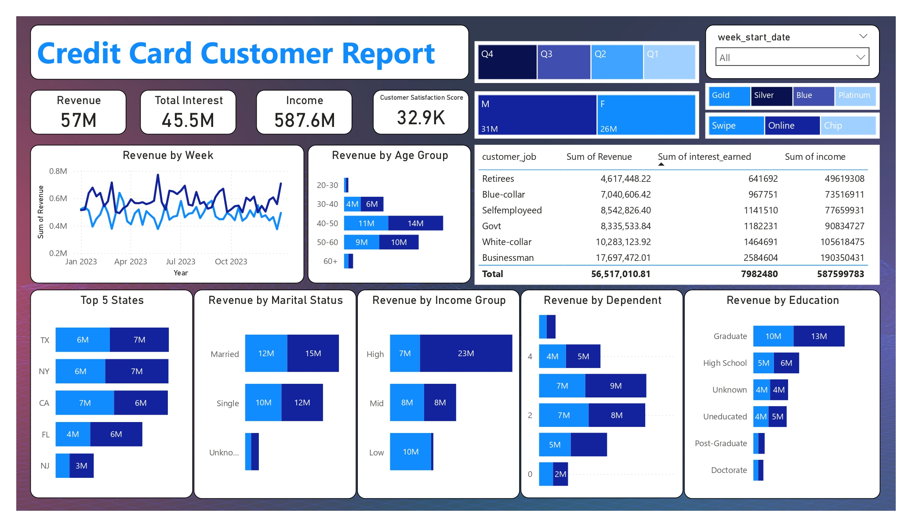
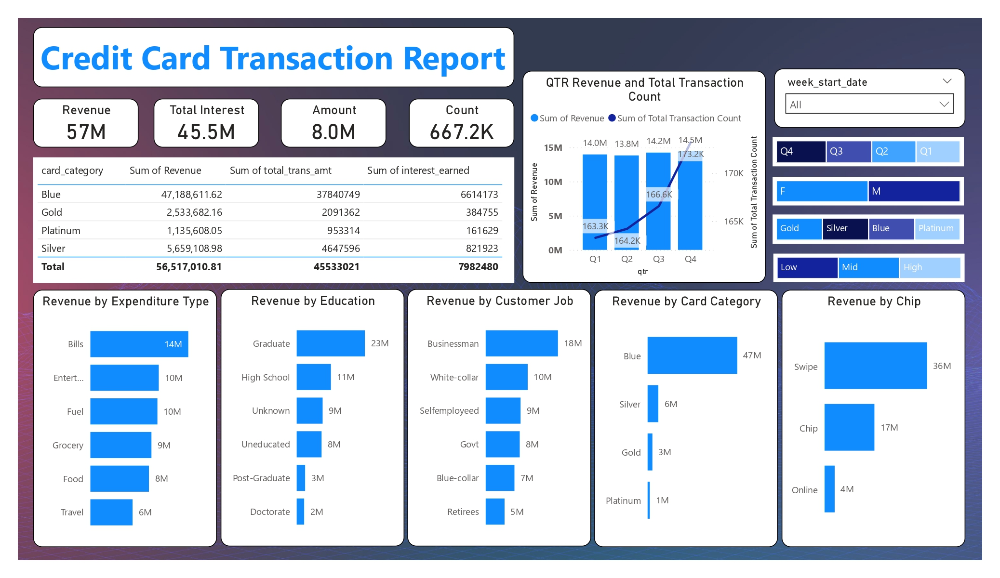

# 📊 Credit Card Financial Weekly Dashboard (Power BI)

## 📝 Overview
To develop a comprehensive credit card weekly dashboard that provides real-time insights into key performance metrics and trends, enabling stakeholders to monitor and analyze credit card operations effectively.

---

## ✨ Features
- Real-time credit card KPIs and trends
- Age and income group segmentation
- Weekly and YTD revenue analysis
- Card type and regional contribution breakdown
- Activation and delinquency rates
- Multi-page interactive dashboard

---

## ⚙️ Steps Performed
1. **Data Preparation**
   - Imported CSV files into SQL database
   - Created tables for customer and transaction details
   - Connected SQL database to Power BI
2. **Data Cleaning & Transformation**
   - Used Power Query for preprocessing
   - Handled missing values and standardized formats
3. **DAX Calculations**
   - Age Group segmentation:
     ```DAX
     AgeGroup = SWITCH(
       TRUE(),
       'public cust_detail'[customer_age] < 30, "20-30",
       'public cust_detail'[customer_age] >= 30 && 'public cust_detail'[customer_age] < 40, "30-40",
       'public cust_detail'[customer_age] >= 40 && 'public cust_detail'[customer_age] < 50, "40-50",
       'public cust_detail'[customer_age] >= 50 && 'public cust_detail'[customer_age] < 60, "50-60",
       'public cust_detail'[customer_age] >= 60, "60+",
       "unknown"
     )
     ```
   - Income Group segmentation
   - Weekly revenue comparison (current vs previous week)
   - KPIs: Revenue, Transactions, Interest Earned, Customer Count
4. **Dashboard Creation**
   - Multi-page dashboard with:
     - Revenue trends (WoW & YTD)
     - Customer demographics (Age, Income, Gender)
     - Card type contribution (Blue & Silver cards)
     - Regional analysis (TX, NY, CA → 68% of revenue)
     - Activation & delinquency rates

---

## 🖼️ Screenshots



---

## 📈 Key Insights
- **Week 53 (31st Dec)**:
  - Revenue ↑ 28.8% WoW
  - Transaction amount & count increased significantly
  - Customer count growth observed
- **Year-to-Date (YTD)**:
  - Overall revenue: 57M
  - Total interest: 8M
  - Transaction amount: 46M
  - Male customers: 31M revenue, Female: 26M
  - Blue & Silver cards: 93% of transactions
  - TX, NY, CA: 68% of revenue
  - Activation rate: 57.5%
  - Delinquent rate: 6.06%

---

## 🛠️ Tools & Technologies
- Power BI (Dashboard & DAX)
- PostgreSQL (Database)
- SQL (Data storage & queries)
- Power Query (Data cleaning & transformation)

---

## 🎬 Demo Video
- [Dashboard Walkthrough on YouTube](https://youtu.be/MjHptZHReEA)

---

## 📁 Project Files
- credit_card.csv - Credit card transaction data
- customer.csv - Customer information
- cc_add.csv - Additional credit card data
- cust_add.csv - Additional customer data
- Credit_Card_Report.pbix - Power BI dashboard file
- Credit_Card_Report.pdf - Power BI dashboard file (PDF)
- README.md - Project documentation
- Screenshots/ - Dashboard images

---

### License
This project is licensed under the MIT License — see the [LICENSE](LICENSE) file for details.

---

### Author
Created by **Osanda Madugalle**  
🌐 [osandamadugalle.me](https://osandamadugalle.me)